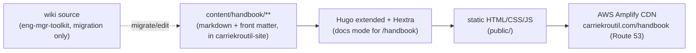
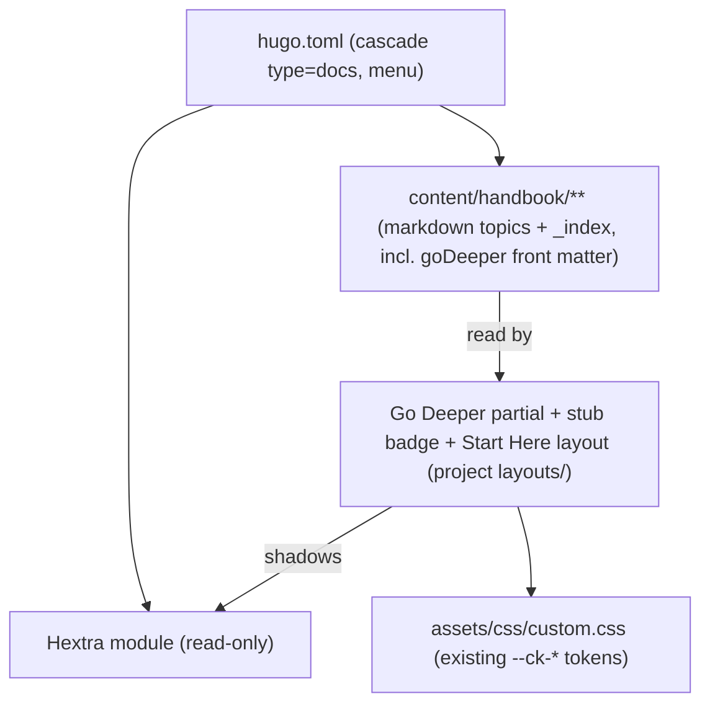

# Architecture Spine — Engineering Manager Handbook

The Handbook is a **new wing of an existing house**, not a new building. The whole site pipeline — authoring, build, deploy, theming, no-JS-core — is already decided by the [carriekroutil.com parent spine](../../../../../carriekroutil-site/_bmad-output/planning-artifacts/architecture/architecture-carriekroutil-site-2026-06-22/ARCHITECTURE-SPINE.md) and inherited here unchanged. This spine fixes only the invariants the Handbook *adds* — the calls two topic authors (or you-this-week vs. you-in-three-months) could otherwise make incompatibly.

## Design Paradigm

**Inherited, unchanged: build-time static generation, content-as-source.** The git repo is the single source of truth; every deploy is a pure one-way pipeline with no runtime server state. Authoring touches only `content/`; everything downstream is mechanical.

The Handbook's one *projection* of that paradigm: it renders in **Hextra docs mode** (persistent left sidebar tree + right-hand on-this-page TOC), where the rest of the site renders in custom blog/landing layouts. Same engine, different content type — selected per-section via `cascade`, not site-wide. (Build-verified: Hextra does **not** show the sidebar tree without `type: docs`; the cascade is required.)



## Inherited Invariants

From the carriekroutil.com parent spine — **binding and read-only here**; never re-derived, never renumbered. A local decision that contradicts one of these is a conflict to surface, not an override.

| Inherited | From parent | Binds here |
| --- | --- | --- |
| AD-1 — authoring loop is `write markdown → git push` | carriekroutil.com | No CMS/editor/upload step may enter Handbook authoring (AD-20 keeps published content single-homed). |
| AD-2 / AD-11 / AD-12 — one Amplify pipeline, `main` only, prod-only, build-fails-notify | carriekroutil.com | The **entire deploy/environment envelope**. Handbook ships through the existing pipeline; no new infra, branch previews, or environment (FR-12). |
| AD-3 — content front-matter is YAML; metadata derived-not-hand-entered | carriekroutil.com | Template for the Handbook's own topic contract (AD-15); "last updated" is git-derived, mirroring read-time. |
| AD-4 — URL derives from content dir + folder name, not `type` | carriekroutil.com | `/handbook/{section}/{topic}/` URLs derive from the tree (AD-14); slug = folder/file name (AD-21, AD-22). |
| AD-5 — all customization in project `layouts/` + `assets/`, never in the Hextra module | carriekroutil.com | The Go Deeper renderer, stub badge, and Start Here layout are project overrides (AD-17, AD-18, AD-19). |
| AD-9 — images via page bundles; alt text required, **build-failing** | carriekroutil.com | Governs any image-bearing topic (AD-15 permits a bundle for those); alt-text build-fail still applies. |
| AD-10 — versions pinned (Hugo via `HUGO_VERSION`, Hextra in `go.mod`); upgrades deliberate | carriekroutil.com | Handbook adds no dependency and no version drift. |
| AD-13 — core reading works with JS disabled; FlexSearch is the one allowed JS exception | carriekroutil.com | Sidebar, TOC, topic bodies, Start Here, Go Deeper render as static HTML; search is the only JS surface (FR-7). |
| Conventions: dark-default + toggle; tokens owned by UX/`custom.css`; lowercase taxonomy; cookieless analytics | carriekroutil.com | Brand continuity (FR-11) and analytics/SEO (FR-13) are inherited, not re-decided. |

## Invariants & Rules

New decisions, numbered **continuing from the parent's AD-13** so every ID is unique across the whole site's architecture and downstream can cite without collision.

Dependency direction (extends the parent's; project overrides may shadow the module, never the reverse; content depends on nothing):



### AD-14 — The Handbook is a Hextra docs-mode section at `/handbook`
- **Binds:** FR-1, FR-2
- **Prevents:** copying the posts section's pattern (parent AD-4 *replaced* Hextra's blog layouts) here and losing the native docs sidebar + TOC; or docs chrome leaking onto the blog.
- **Rule:** `content/handbook/_index.md` sets `cascade: { type: docs }` so **only** Handbook pages use Hextra's native docs layout (left sidebar tree + on-this-page TOC); posts, home, and about are untouched. URLs derive from the content tree — `/handbook/{section}/{topic}/` (inherited AD-4). A single `[[menu.main]]` entry is added to `hugo.toml` at **`weight = 15`** (between Posts=10 and About=20), label **"Handbook"** (clean global-nav register, matches the `/handbook/` URL; the full "Engineering Manager Handbook" identity lives in the page H1, `<title>`, and share metadata).

### AD-15 — Canonical topic front-matter contract
- **Binds:** all Handbook topics; FR-4, FR-6
- **Prevents:** independently-authored topics diverging on field names, sidebar position, SEO metadata, or how "not yet written" is expressed — the highest-divergence-risk surface in a 40+ page handbook.
- **Rule:** Every topic carries **YAML** front matter:
  - `title` (string)
  - `weight` (int) — sidebar order within its Section; **unique within the Section** (AD-16)
  - `description` (string) — meta/SEO description (per UX EXPERIENCE; no per-topic meta drift)
  - `stub` (optional bool, default `false`) — the **one** stub signal (AD-18)
  - `goDeeper` (list) — the curated block data (AD-17)
  - `lastUpdated` (RFC-3339/ISO date) — **authored in front matter**, rendered under the title. Hand-maintained (not git-derived): bump it when you meaningfully change a page. This trades the parent's derive-don't-hand-enter ideal (AD-3) for a deterministic value that needs no `enableGitInfo` and is immune to Amplify's shallow clone. Never `draft: true` on a stub (parent AD-3 would exclude it — see AD-18).
- **File shape:** a **flat file** `content/handbook/{section}/{topic}.md` is the default (per UX EXPERIENCE). A page **bundle** `{topic}/index.md` is permitted **only** when a topic has co-located images, in which case inherited **AD-9** (alt-text build-fail) governs them.

### AD-16 — Sidebar order is content-tree `weight`, unique, in the locked 12-Section sequence
- **Binds:** FR-2
- **Prevents:** two Sections (or two topics) racing for one slot, or Hugo's unstable title/path tie-break scrambling the curated sequence.
- **Rule:** Each Section's `_index.md` sets `weight` `1..12` in the fixed order (see AD-21). Topics order by their own `weight` **within** a Section, and weights are **unique within that Section** (no ties — Hugo's fallback ordering is unstable). Every topic is reachable from the tree — no orphans.

### AD-17 — Go Deeper is a front-matter data block, build-failing when empty
- **Binds:** FR-5; SM-C3
- **Prevents:** every topic hand-rolling its own closing-block markup → structural and visual drift across every page; two authors passing item data in different shapes; and the block silently shipping empty on a stub (the exact risk SM-C3 names).
- **Rule:** Go Deeper is authored as a **`goDeeper` front-matter list**, *not* free-form markdown, and rendered at the end of every topic by a project partial (in `layouts/`, per AD-5). Per-item schema is **pinned**: `{ group, title, url, why }` where `group` ∈ **`Books` · `Courses` · `Tools`** (closed enum; a group renders only when populated). External links open in a new tab with `rel="noopener"` (per UX). Group labels use the **existing** `--ck-chip-{violet,fuchsia,amber}-text` tokens already in `custom.css`. The render **fails the build** if a topic — including a stub — has no `goDeeper` items (mirrors parent AD-9's alt-text discipline). *(Supersedes the PRD's loose "likely a shortcode" note — architecture's delegated call.)*

### AD-18 — Stub state is a front-matter flag driving a render; stubs are never hidden
- **Binds:** FR-6, FR-10
- **Prevents:** an author reaching for `draft: true` to mark "not done" — which (parent AD-3) drops the page from build, nav, and search, silently breaking the "complete IA, nothing 404s" launch promise.
- **Rule:** `stub: true` (AD-15) is the **only** stub mechanism. It renders an inline **"🚧 Expanding" badge** beside the title — a non-heading element, so it never disturbs heading order or the auto-TOC (per UX DESIGN), and purely informational (not a link). The author's stub intro is honest framing prose and **does not repeat the badge label verbatim** (the badge is layout-rendered from the flag; the intro is microcopy). A stub builds, navigates, searches, and carries its Go Deeper block exactly like a full topic; it is never a 404 and never empty.

### AD-19 — Start Here landing overrides the docs frame, scoped to the root only
- **Binds:** FR-3
- **Prevents:** `/handbook` rendering as a bare docs section-index (empty body); and — the inverse trap — the Start Here layout leaking onto all 12 Section index pages.
- **Rule:** `content/handbook/_index.md` plus a custom layout override (in `layouts/`, per AD-5) renders the guided-path **step cards** + a **section grid** in a single centered column (sidebar still present; the three-column docs frame deliberately broken). The override is **scoped to the `/handbook/` root index only** — the override file is **`layouts/docs/list.html`** (the docs `list.html` slot), **not** `layouts/handbook/list.html`: `cascade type:docs` routes every handbook section-list page to the docs *type* slot, which outranks the `handbook` *section* slot in Hugo's lookup order, so a section-named template never runs (verified empirically in Story 3.1). Because that one slot also serves the 12 Section indexes, the override **must guard on the root path** (`eq .RelPermalink "/handbook/"`) and delegate every other handbook page to Hextra's default docs section-list, so the 12 Section `_index.md` pages render unchanged. The page carries **no on-page search box** (header ⌘K covers it — UX build note) and offers an explicit "experienced? jump to the reference or search" affordance.

### AD-20 — Published Handbook content has exactly one home
- **Binds:** FR-9, FR-12
- **Prevents:** the same topic markdown maintained in both repos and silently diverging.
- **Rule:** `eng-mgr-toolkit` (this repo) holds BMAD planning artifacts and the raw wiki source **for migration only**. The authored, published topic markdown lives **solely** in `carriekroutil-site/content/handbook/` and ships via the inherited single Amplify pipeline (parent AD-2 / AD-11). No second pipeline, repo, or domain (FR-12; non-goal). Migration is a one-way port-and-edit, not an ongoing sync.

### AD-21 — Binding Section folder-slug map
- **Binds:** FR-2, AD-16, AD-19, AD-22
- **Prevents:** "The Transition" (and the other named Sections) being slugged inconsistently by different authors, breaking sidebar URLs and the guided-path links into strings nobody owns.
- **Rule:** The 12 Section folder slugs are **fixed**, in order:

  | # | Section | Folder slug |
  | --- | --- | --- |
  | 1 | The Transition (Engineer → Manager) | `the-transition` |
  | 2 | Managing Yourself | `managing-yourself` |
  | 3 | People & Leadership | `people-leadership` |
  | 4 | Performance & Growth | `performance-growth` |
  | 5 | Hiring & Team Building | `hiring-team-building` |
  | 6 | Team Health & Operations | `team-health-operations` |
  | 7 | Delivery & Execution | `delivery-execution` |
  | 8 | Operational Excellence | `operational-excellence` |
  | 9 | Tools & Productivity | `tools-productivity` |
  | 10 | Building with AI | `building-with-ai` |
  | 11 | Security & Governance | `security-governance` |
  | 12 | Engineering Foundations | `engineering-foundations` |

  Topic slugs derive from each topic's file/folder name (inherited AD-4), are human-readable and stable, and are referenced only via AD-22.

### AD-22 — Cross-topic and guided-path links use Hugo `relref` (build-failing)
- **Binds:** FR-3; AD-19; all internal Handbook links
- **Prevents:** a topic-folder rename (slug = author-owned mutable name, AD-4) silently 404-ing a Start Here path card or a cross-reference.
- **Rule:** Every internal Handbook link — the guided-path step cards (AD-19), the section grid, and any topic-to-topic reference — uses Hugo `ref`/`relref`, which **fails the build** on a missing target. Hand-written `/handbook/...` path strings are not used for internal links.

## Consistency Conventions

Defaults that bind where independent authors would otherwise drift. Inherited site-wide conventions (dates, alt-text-build-fail, dark default, privacy) are **not** restated — see the parent spine.

| Concern | Convention |
| --- | --- |
| Topic location & URL | flat `content/handbook/{section}/{topic}.md` → `/handbook/{section}/{topic}/`; bundle only for image-bearing topics (AD-15, AD-9) |
| Section slugs | the fixed 12-slug map (AD-21); never re-slugged |
| Section/topic ordering | unique `weight` per level in each `_index.md` / topic (AD-16) |
| Front-matter format | YAML; `title` + `weight` + `description` + `lastUpdated` always; `stub`, `goDeeper` as applicable (AD-15) |
| "Last updated" | authored `lastUpdated` (RFC-3339) in front matter, hand-bumped on meaningful edits (AD-15) |
| Stub marker | `stub: true` → inline "🚧 Expanding" badge; amber, calm, **never** red or an `Hn`; not repeated in the intro prose (AD-18) |
| Go Deeper | `goDeeper` front-matter list `{group∈Books·Courses·Tools, title, url, why}`; rendered last on **every** topic; **empty fails the build** (AD-17) |
| Internal links | Hugo `ref`/`relref` only, build-failing on broken targets (AD-22) |
| External links | open in a new tab with `rel="noopener"`; descriptive text, never "click here" (per UX) |
| Topic anatomy | title → framing intro → body (or "coming soon" framing for stubs) → Go Deeper, in that order (FR-4) |
| Long topics | kept as one page; Hextra auto-TOC handles in-page nav; split only when a sub-part earns its own URL/search hit |
| Accent tokens | reuse existing `--ck-chip-*` / `--ck-accent-text` vars in `custom.css`; introduce **no** new color values (FR-11) |
| Search scope | inherited FlexSearch; `maxSectionResults=1` yields one result per topic for docs pages too — build-verified (FR-7); no Handbook-specific tuning |
| Tags | **none** in the Handbook (docs navigates by sidebar + search); the blog keeps its `tags` taxonomy — no conflict (FR-8 retired) |
| Branch & launch | all Handbook work lands on **one feature branch**, never on `main`; **nothing deploys until that branch is merged** (inherited AD-2: build on push to `main` only, previews off — Amplify preview builds **verified disabled in the console 2026-06-25**). Merge = the full go-live (complete IA + stubs). `hugo server` is the only pre-merge preview. |

## Stack

*Seed — reality-verified against `carriekroutil-site` on disk and a local Hugo build (2026-06-25); the code owns this once it exists. The Handbook adds **no** new dependency.*

| Name | Version |
| --- | --- |
| Hugo (extended) | pinned `HUGO_VERSION=0.163.3` in `amplify.yml` (inherited) |
| Hextra theme | v0.12.3, locked in `go.mod` (inherited) |
| Go (toolchain) | 1.26.4 in build; `go 1.25.3` directive (inherited) |
| Hosting / CDN / DNS | AWS Amplify + Route 53 (inherited) |
| Search | Hextra FlexSearch, `index=content`, `maxSectionResults=1` (inherited) |

## Structural Seed

What the Handbook adds inside the existing `carriekroutil-site` tree. The code owns the detail; this is scaffold, not a mirror to maintain.

```text
carriekroutil-site/
  hugo.toml                      # + [[menu.main]] "Handbook" (weight 15) (AD-14)
  content/
    handbook/
      _index.md                  # Start Here landing + cascade {type: docs} (AD-14, AD-19)
      the-transition/
        _index.md                # Section: title + weight=1 (AD-16, AD-21)
        {topic}.md               # flat topic: title, weight, description, lastUpdated, stub?, goDeeper[] (AD-15, AD-17)
      managing-yourself/         # weight=2 ... through ...
      engineering-foundations/   # weight=12 (last)
        {topic}/index.md         # bundle form — only when a topic ships images (AD-15, AD-9)
  layouts/
    docs/                        # /handbook/** is the only docs-type content, so docs/* templates are handbook templates
      list.html                  # Start Here override (root-guarded) + theme-default delegation for the 12 sections (AD-19)
      single.html                # topic template override: stub badge, authored lastUpdated, Go Deeper (AD-15/17/18)
    _partials/custom/
      go-deeper.html             # renders goDeeper[] front matter; build-fails if empty (AD-17)
      stub-badge.html            # inline "🚧 Expanding" render from stub flag (AD-18)
  assets/css/custom.css          # reuse existing --ck-chip-* tokens; docs-mode deltas only (AD-17, FR-11)
```

## Capability → Architecture Map

| Capability / FR | Lives in | Governed by |
| --- | --- | --- |
| Handbook section + header nav (FR-1) | `content/handbook/_index.md`, `hugo.toml` menu | AD-14 |
| Sidebar tree, 12 Sections fixed order (FR-2) | `content/handbook/**/_index.md` weights + slug map | AD-16, AD-21, AD-14 |
| Start Here guided path (FR-3) | `content/handbook/_index.md` + `layouts/docs/list.html` (root-guarded; docs type slot) | AD-19, AD-22 |
| Consistent topic anatomy + last-updated (FR-4) | topic front matter + Hextra docs layout | AD-15, AD-14 |
| Go Deeper on every topic (FR-5) | `goDeeper` front matter + `go-deeper.html` partial | AD-17 |
| Stub treatment (FR-6) | `stub` front matter + `stub-badge.html` | AD-18, AD-15 |
| Full-text search (FR-7) | inherited FlexSearch config | AD-13 (inherited), conventions |
| Migrate wiki content (FR-9) | wiki source (this repo) → `content/handbook/` | AD-20 |
| Complete IA with stubs at go-live (FR-10) | full section/topic tree, stubs filling gaps | AD-16, AD-18, AD-21 |
| Brand consistency (FR-11) | `custom.css` existing tokens | conventions, inherited UX spine |
| Ships via existing pipeline (FR-12) | `amplify.yml` (unchanged) | AD-20, inherited AD-2/AD-11 |
| Analytics & discoverability (FR-13) | inherited GoatCounter + sitemap/robots | inherited conventions |

## Deferred

Pushed down on purpose — none are launch gates:

- **Tags / cross-cutting taxonomy for the Handbook (FR-8, retired)** — docs navigates by sidebar + search; revisit only if cross-cutting discovery proves needed.
- **Interactive tools/widgets** (e.g. a levers calculator), per-topic feedback, Handbook-specific RSS — explicit PRD non-goals; out of v1.
- **Broken-link / outdated-content audit of migrated pages** — carried into the migration work, flag-and-fix as encountered (PRD Open Question 1), not an architecture gate.
- **Light-mode AA for the new stub badge only** — the inherited accent tokens already ship AA-paired light companions (`#6d28d9 / #a21caf / #92400e`, already in `custom.css`); that state is **closed**. The only remaining check is the new stub-badge color on Hextra's light surfaces before relying on light mode.

## Open Questions

*Both prior open questions resolved (2026-06-25): nav label = "Handbook" (AD-14); "last updated" = authored front-matter `lastUpdated`, no git derivation (AD-15). None outstanding.*
